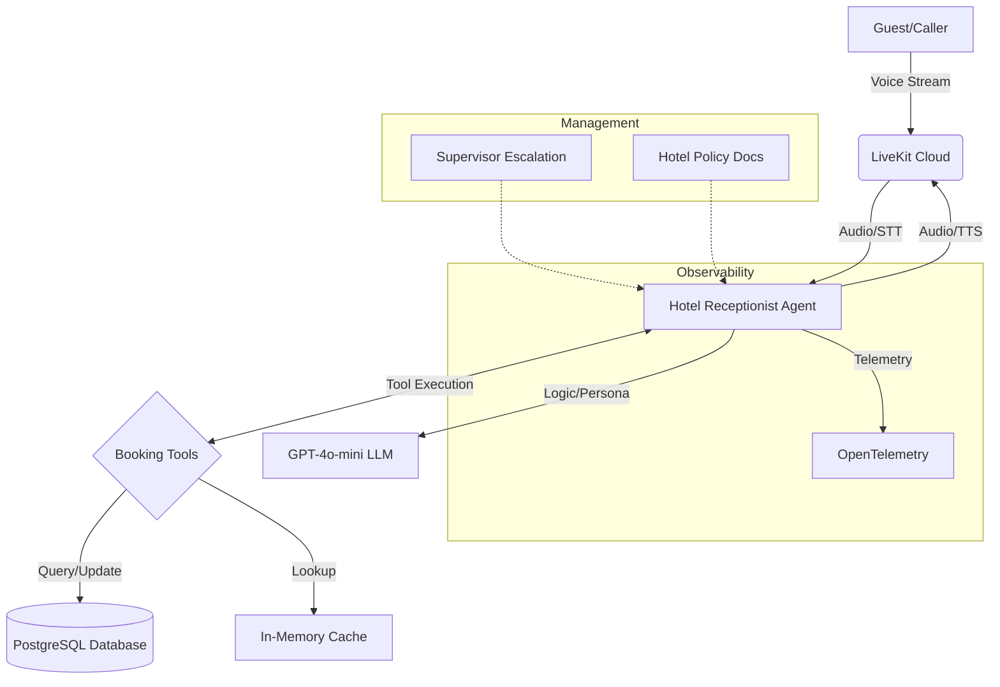

# Hotel Agent

This project is an AI-powered agent designed for hotel management automation, built using the [LiveKit Agents](https://docs.livekit.io/) framework.

## Overview
The Hotel Agent is an AI-driven, voice-interactive receptionist that automates the hotel booking lifecycle. It acts as a professional, 24/7 staff member capable of handling guest inquiries, booking rooms, and managing reservations in real-time, providing a frictionless, human-like booking experience while ensuring complete data integrity and operational efficiency for the hotel.

## Key Features
- **Voice Interaction:** Real-time conversational AI capabilities.
- **Advanced Integration:** Built on top of LiveKit's robust agent framework.
- **Modular Design:** Uses a variety of plugins for enhanced functionality, including DeepSeek/OpenAI for intelligence, ElevenLabs/Google/Sarvam for speech, and Silero/Turn Detection for VAD.
- **Scalable:** Built with FastAPI and asynchronous processing for high performance.

## How It Works
The Hotel Agent acts as an automated receptionist, managing hotel bookings through voice.

### 1. Agent Orchestration
Built with `LiveKit Agents` and orchestrated by an `AgentServer`, the system maintains real-time sessions for seamless voice communication.

### 2. Conversation Flow
- **Speech-to-Text:** Uses `sarvam` for English (IN) speech-to-text.
- **Intelligence:** Employs `gpt-4o-mini` for intelligent conversational logic.
- **Persona:** Implements custom `persona.py` instructions to handle hotel-specific scenarios.
- **Speech Synthesis:** Uses `sarvam` for natural-sounding text-to-speech.

### 3. Booking Intelligence
When a guest wants to book, the agent uses integrated **Tool Calling** to:
- Check room availability instantly.
- Normalize spoken phone numbers using a robust heuristic (found in `booking.py`).
- Execute atomic database transactions (using SQL CTEs) to ensure a room is locked and reserved without any risk of double-booking.

### 4. Core Modules
- `agent.py`: Entrypoint that initializes the LiveKit session, sets up the receptionist persona, and configures STT/TTS plugins.
- `booking.py`: Manages lifecycle of bookings:
    - `get_room_price`: Fetches room pricing from an in-memory cache.
    - `create_booking`: Marks rooms unavailable with atomic database operations.
    - `cancel_booking`: Frees up rooms.
    - `get_booking`: Retrieves full details for a single booking by ID.
    - `_normalize_phone`: Normalizes spoken phone numbers for accurate storage.
- `search.py`: Handles queries for availability and finding existing bookings by name or phone.
- `regulations.py`: Provides hotel policy information.
- `escalate.py`: Handles supervisor escalation requests.
- `db.py`: Maintains database connection pool management.
- `persona.py`: Builds context-aware instructions for the LLM to act as a helpful hotel staff member.

### 5. Data Reliability
To ensure integrity, the booking system uses robust SQL Common Table Expressions (CTEs) to perform locks, inserts, and updates atomically. This prevents race conditions like double-booking rooms.

### 6. Observability
Integrated with `OpenTelemetry` for comprehensive monitoring and debugging, ensuring agent performance can be tracked in production.

## System Architecture

The following diagram illustrates the data and control flow within the Hotel Agent system:



### Architectural Breakdown:

1. **The Core Engine (LiveKit Agent):**
   - Central orchestrator holding conversational state, managing STT/TTS streams, and coordinating tool-use.
   - Operates entirely asynchronously for high concurrency.

2. **Data Layer (PostgreSQL/asyncpg):**
   - Employs atomic SQL CTEs for booking integrity (lock, insert, update in one transaction).

3. **In-Memory Cache Layer:**
   - Room pricing data is cached at startup for sub-millisecond price lookups.

4. **Speech Processing Pipeline:**
   - Audio → Noise Cancellation → `sarvam` STT → LLM → `sarvam` TTS → Audio.

5. **Tool Orchestration:**
   - Bridges conversational intent to database operations using validated function tool schemas.

6. **Monitoring & Observability:**
   - `OpenTelemetry` provides end-to-end tracing for latency and tool success analysis.

7. **Resiliency:**
   - Pre-warm hooks ensure DB pool readiness before incoming calls.

## Prerequisites
- Python >= 3.10
- LiveKit Cloud account (or self-hosted LiveKit server)

## Getting Started

1. **Install dependencies:**
   Ensure you have `uv` installed, then run:
   ```bash
   uv sync
   ```

2. **Configure Environment:**
   Copy the `env_ex.txt` to `.env` and fill in your API keys (OpenAI, LiveKit, etc.).
   ```bash
   cp env_ex.txt .env
   ```

3. **Run the agent:**
   ```bash
   python -m src.agent
   ```

## Development and Testing

- **Testing:** The project includes a `src/tests` directory with pytest-based tests.
- **Formatting:** Managed using `ruff` for linting and formatting.
- **Async Mode:** Uses `asyncio` extensively for high-concurrency voice performance.

## Why Hotel Agent?
- **Efficiency:** Drastically reduces manual booking tasks.
- **Accuracy:** Prevents human errors in reservation management.
- **Consistency:** Maintains brand-aligned policy communication.
- **Modern Tech:** Built on the cutting-edge LiveKit stack.

## Built With
- [FastAPI](https://fastapi.tiangolo.com/) - Web framework
- [LiveKit Agents](https://livekit.io/) - Agent orchestration
- [Pydantic](https://docs.pydantic.dev/) - Data validation
- [OpenTelemetry](https://opentelemetry.io/) - Observability
- [asyncpg](https://magicstack.github.io/asyncpg/current/) - PostgreSQL driver

## License
This project is licensed under the terms of the MIT license.